# SE452-Group10

## Purpose

Build an education management system similar to campus connect. The system has three types of users: students, teachers,
and administrators. The system will have information on students and teachers such as personal information and class
information
Students will be able to add/remove classes, check class schedules, and download
The teacher will post class information, types of classes, and when they happen
The administrator will have overarching access as a debugger.

 
* Milestone 1: Define the project and base structure and areas where each member will be working on. 
* Milestone 2: Create project data persistence and some services of each module. 
* MileStone 3: Updated few tables based on requirement, Implemented swagger documentation and created few customizes services. 
* Final Submission: Add fronted web ui and controller associate with Spring Security for 3 type of user to log in and do their authorized operations.

## Project Members

| Member    | Feature    | Note                                                                                                                                                                                                                                |
|-----------|------------|:------------------------------------------------------------------------------------------------------------------------------------------------------------------------------------------------------------------------------------|
| Ayyub     | Account    | For all account types which can be logged into this system including Admin, Teacher and Student. Providing service like account CRUD and login. Data Entity: Admin, Teacher, Student                                           |
| Jared     | Course     | Course and GPA CRUD operation, students/teachers search course and GPA by key word(s). Data Entity: Course, GPA                                                                                                                |
| Bhagya    | Enrollment | Students enroll course to learn, teachers enroll course to teach. Also provide operation of dropping classes. Data Entity: TeacherEnrollment, StudentEnrollment                                                                |
| Srinivasa | Payment    | Add/remove payment methods, calculate the fee based on the student's enrollment of courses, load payment records and Save student card details. Data Entity: PaymentMethod, PaymentRecord, CardDetails, student_balance(NoSQL) |

 

## Conflict Resolution

First we vote, and then roll dice.

 

## Communication Mechanism

Will meet using Discord and Zoom. Will meet once a week on tuesday .

## Meeting Notes

| # | Date      | Note                                                                                                                                              | Participants                    |
|---|-----------|---------------------------------------------------------------------------------------------------------------------------------------------------|---------------------------------|
| 1 | 4.4.2023  | We decided our project scope and setup env.                                                                                                       | Ayyub, Jared, Srinivasa, Bhagya |
| 2 | 4.8.2023  | We create basic project, and initial key features for each of the members of the team.                                                            | Ayyub, Jared, Srinivasa, Bhagya |
| 3 | 4.15.2023 | Divide project into 4 modules, and reassign work for every team member.                                                                           | Ayyub, Jared, Srinivasa, Bhagya |
| 4 | 4.22.2023 | Code-merge session and discussed foreign key implementation.                                                                                      | Ayyub, Jared, Srinivasa, Bhagya |
| 5 | 5.08.2023 | We discussed the swagger implementation. We discussed on few database relations.                                                                  | Ayyub, Jared, Srinivasa, Bhagya |
| 6 | 5.11.2023 | We talked about both group and individual codes and approaches for the project. We discussed the docker image and GitHub workflow implementation. | Ayyub, Jared, Srinivasa, Bhagya |
| 7 | 5.14.2023 | Discuss about the config of postgres sql, and demo the docker to make sure everyone can use it. Do the final check of MS3.                        | Ayyub, Jared, Srinivasa, Bhagya |
| 8 | 5.26.2023 | Discuss the implementation of user authorization and authentication, and assign the the frontend web ui and controller task.                      | Ayyub, Jared, Srinivasa, Bhagya |
| 9 | 6.3.2023  | Check the rubrics and todo list of the final submission, and be ready for the due.                                                                | Ayyub, Jared, Srinivasa, Bhagya |

 

## Decision Made

| # | Area                  | Decision         | Alternative            | Rationale                                                             |
|---|-----------------------|------------------|------------------------|-----------------------------------------------------------------------|
| 1 | IDE                   | IntelliJ IDEA    | VS Code                | Language independent editor so that it can be used in non java course |
| 2 | Dependency Management | Gradle           | Maven                  | familiarity                                                           |
| 3 | Code                  | Lombok           | Code template code     | We have done too many template code and so don't need to learn that   |
| 3 | Communication Channel | Zoom             | Discord                |                                                                       |
| 3 | Configurations        | YML              | Application properties | Liked this approach                                                   |
| 3 | Database              | Postgres,MongoDB | H2                     | Will look into it as the project moves on.                            |

## Appendix

### Working code (Milestone 1):

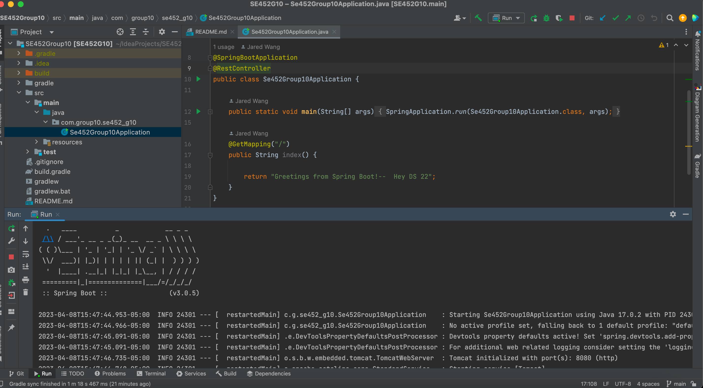
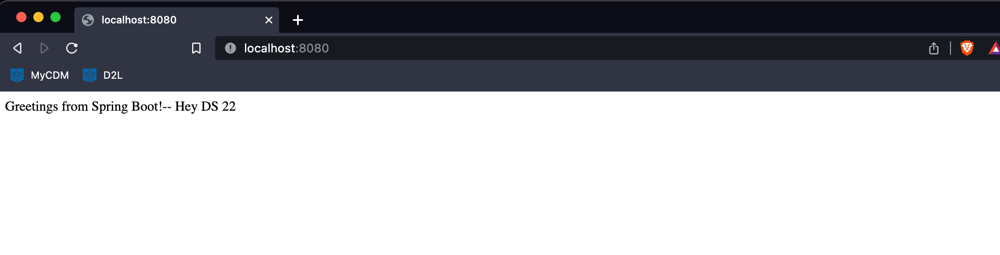

### Working code (Milestone 2):

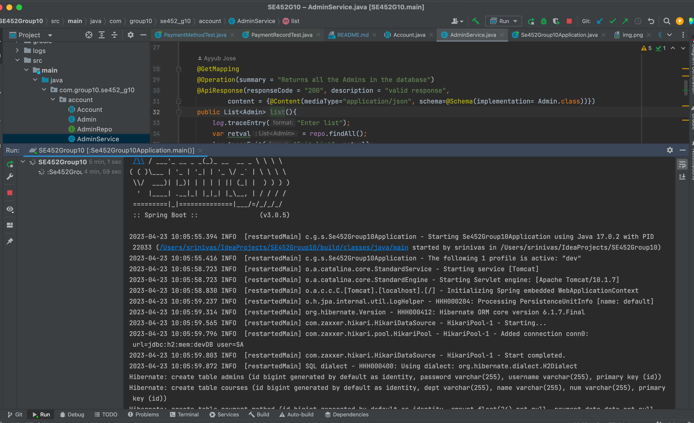
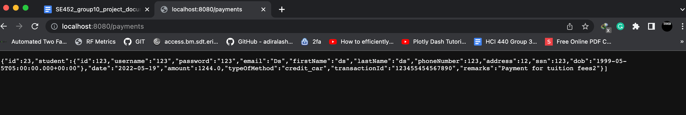

### Working code (Milestone 3):

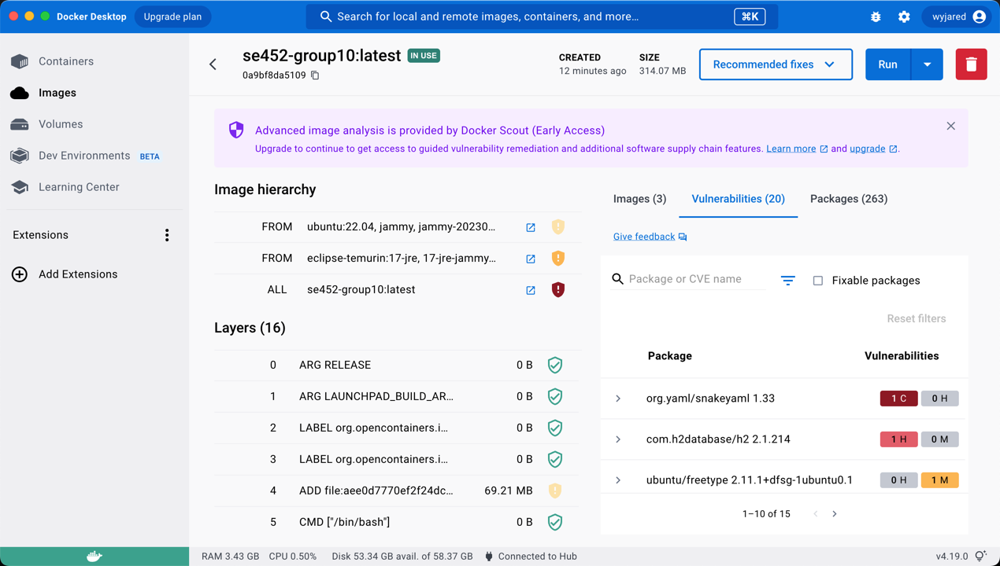
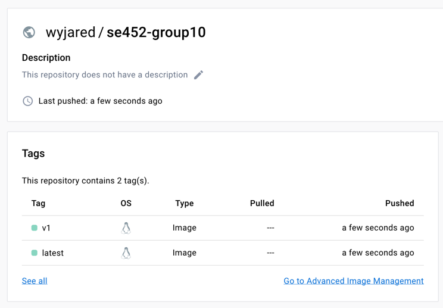

### Working code (Final Submission):

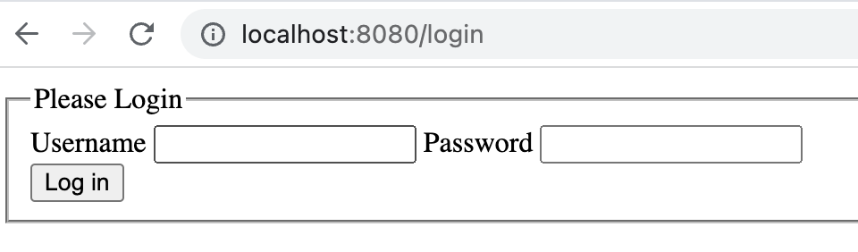
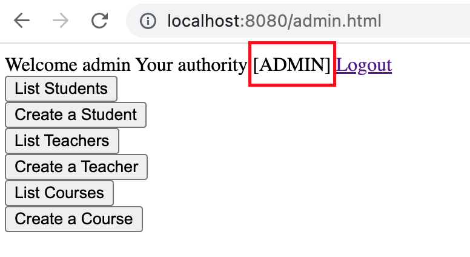

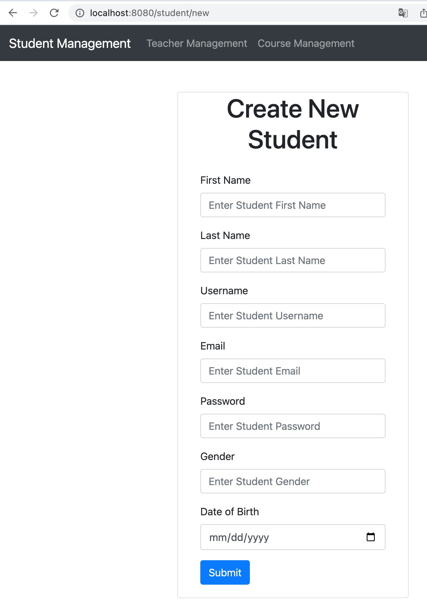
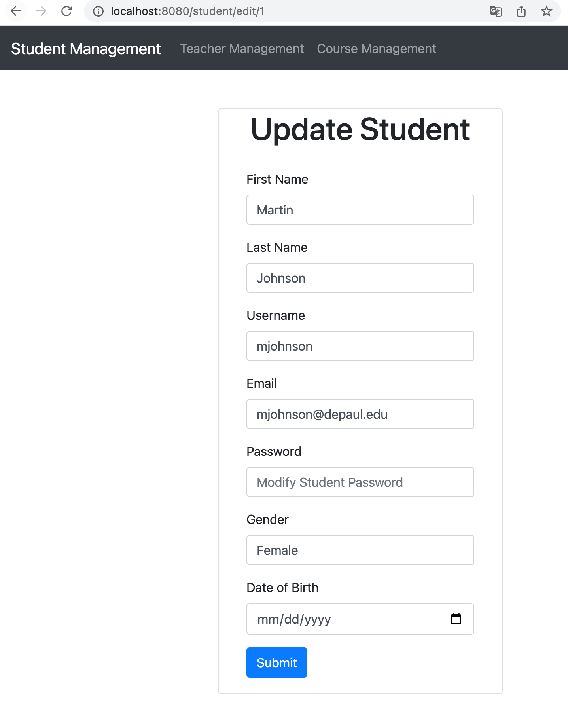
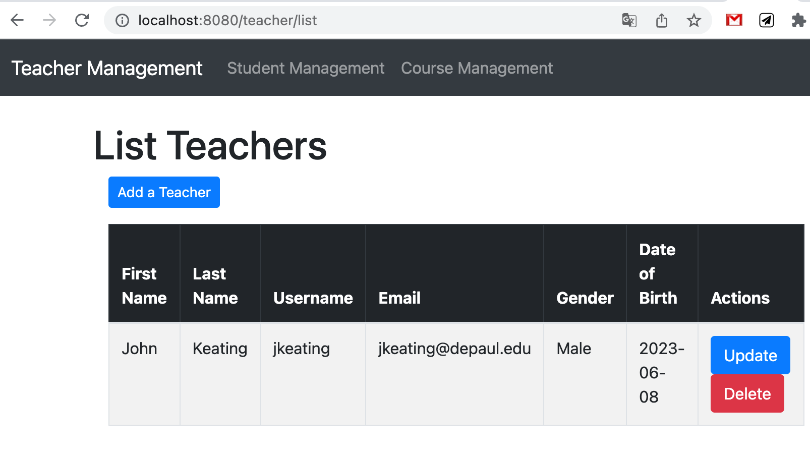
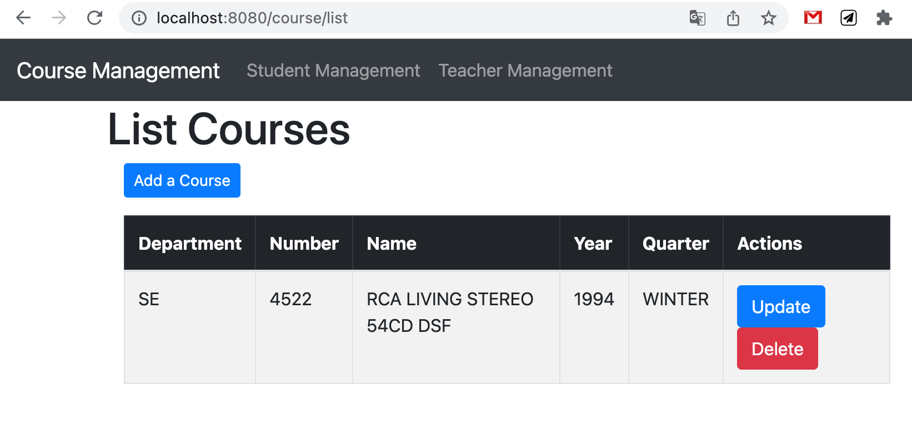
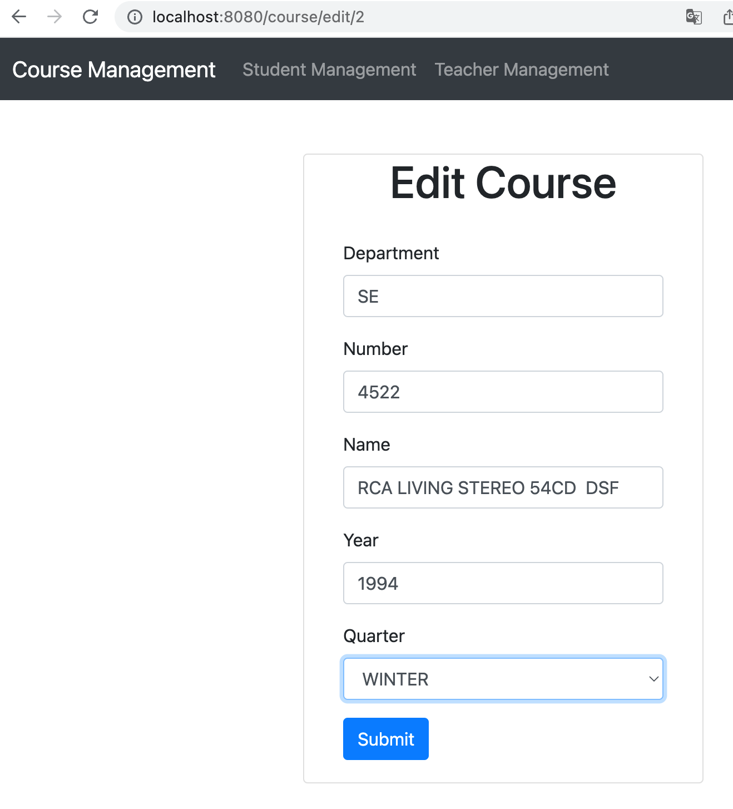
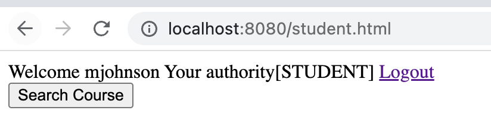
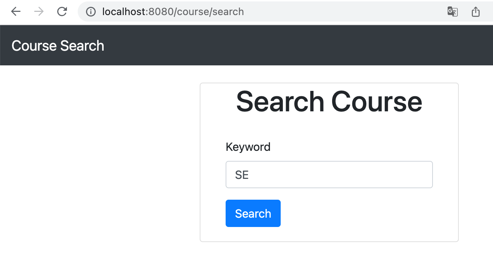
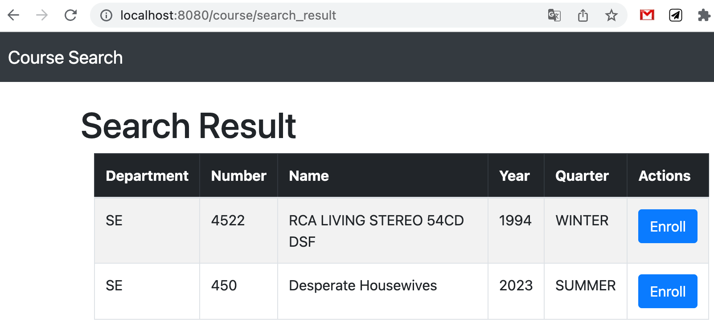
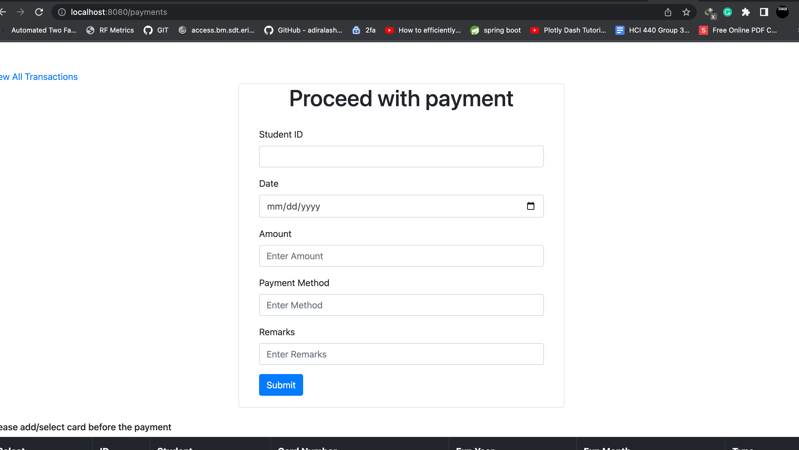
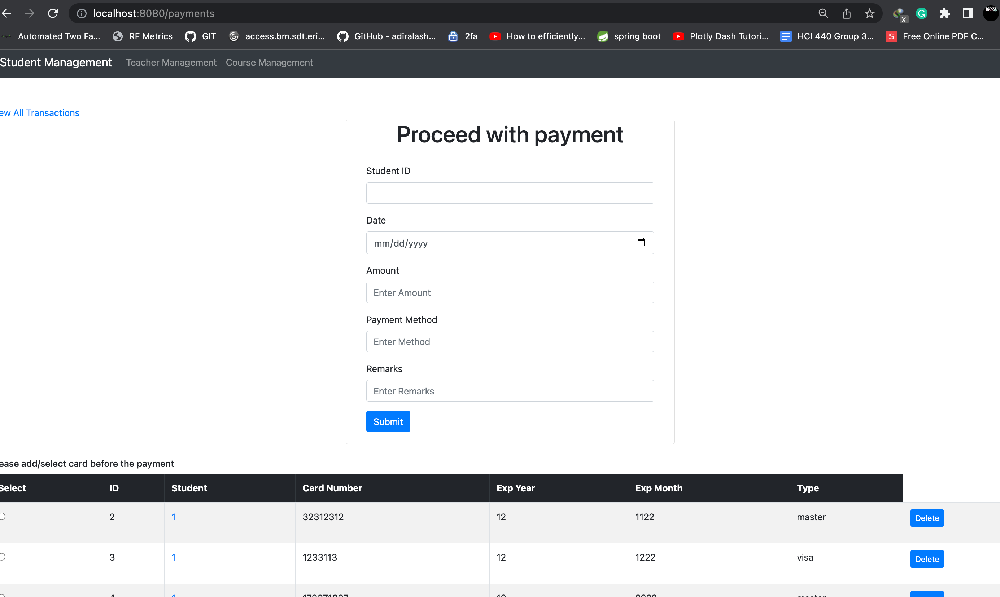
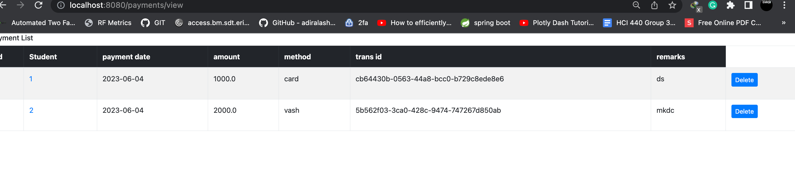
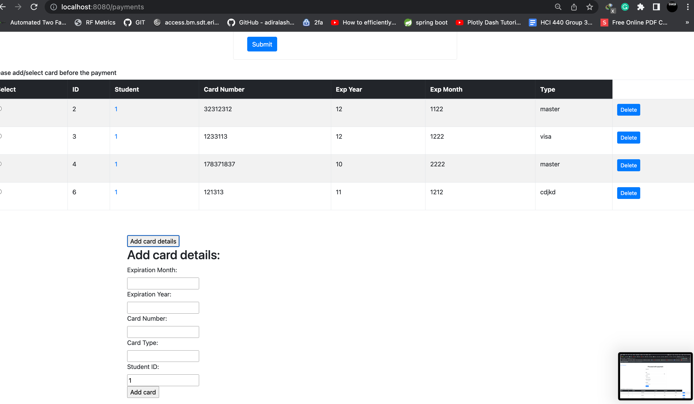